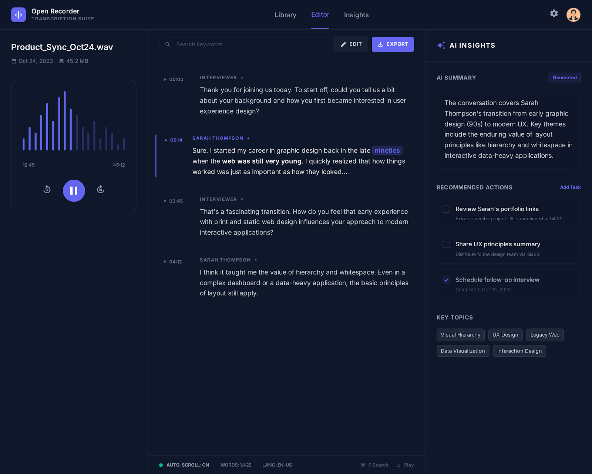
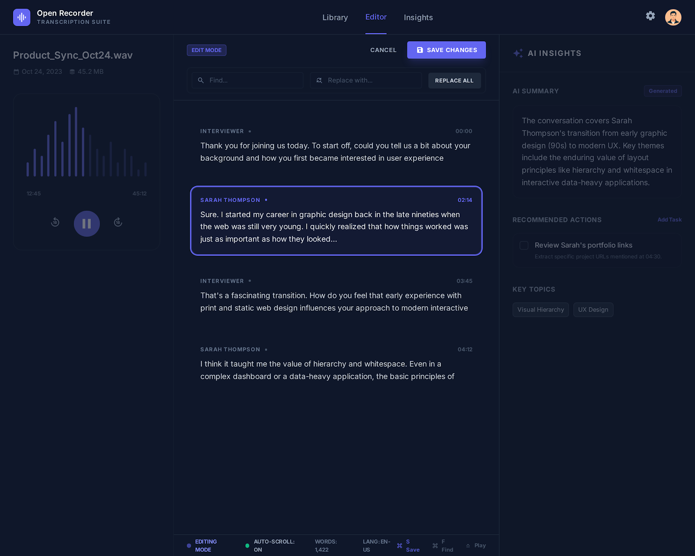
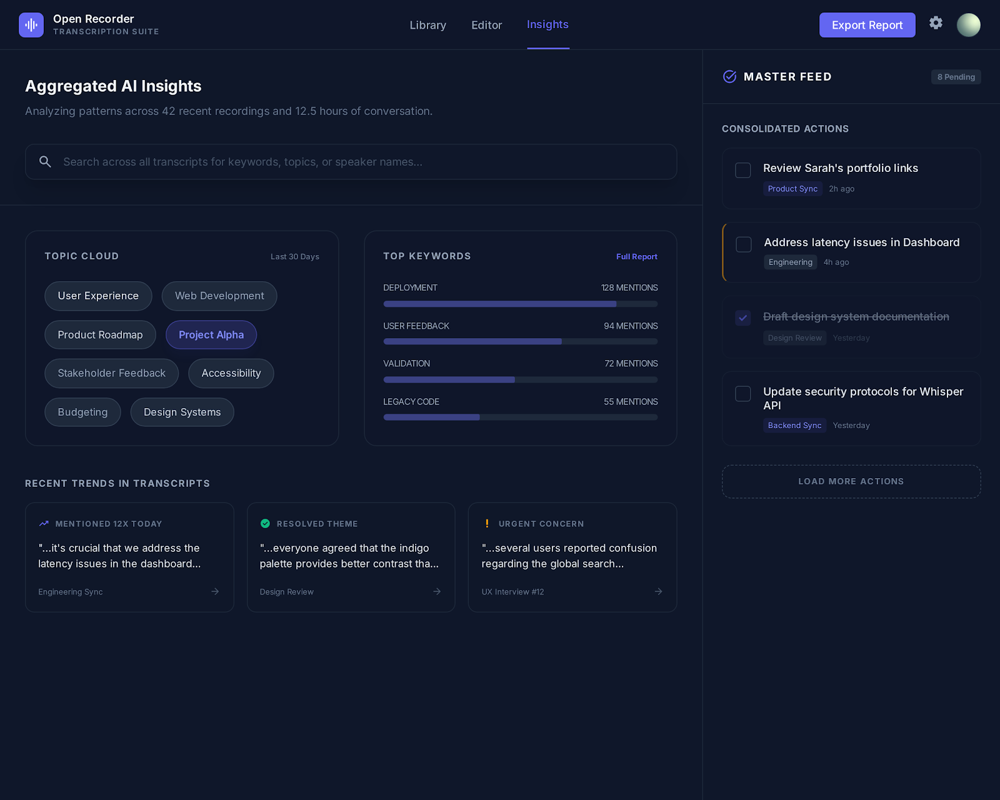

# Open Recorder Tauri

Desktop application to play and manage audio recordings, built with Tauri and Next.js.

## Purpose

Open Recorder aims to fill the gap between AR recorders and traditional recorders. It is not the Plaud system, but it is similar in intent: provide an analysis layer on top of recordings without relying on external services. The idea is that the software performs the full analysis locally, including descriptions, summaries, action points, and key insights.

## Prerequisites

Before running this project, make sure you have:

- **Node.js** (version 18 or later) - [Download Node.js](https://nodejs.org/)
- **Rust** (latest stable) - [Install Rust](https://www.rust-lang.org/tools/install)
- **npm** (included with Node.js)

### Verify installation

```bash
node --version
npm --version
rustc --version
cargo --version
```

## Quick setup

Run the setup script:

```bash
chmod +x setup.sh
./setup.sh
```

Or follow the manual steps below.

## Manual setup

1. **Install Node.js dependencies:**
   ```bash
   npm install
   ```

2. **Rust dependencies install automatically** the first time you run Tauri.

## Run in development

```bash
npm run tauri:dev
```

This command:
- Starts the Next.js development server
- Builds the Rust/Tauri backend
- Opens the desktop application window

## Build for production

```bash
npm run tauri:build
```

The executable will be generated at:
- **macOS**: `src-tauri/target/release/bundle/macos/`
- **Windows**: `src-tauri/target/release/bundle/msi/`
- **Linux**: `src-tauri/target/release/bundle/appimage/`

## Available scripts

- `npm run dev` - Run Next.js only (no Tauri)
- `npm run build` - Build Next.js only
- `npm run start` - Start the Next.js production server
- `npm run lint` - Run ESLint
- `npm run tauri` - Run Tauri CLI commands
- `npm run tauri:dev` - Dev mode with Tauri
- `npm run tauri:build` - Build the desktop app

## Project structure

```
open-recorder-tauri/
├── app/                    # Next.js pages (App Router)
├── src/
│   ├── components/         # React components
│   └── lib/                # TypeScript utilities and types
├── src-tauri/              # Rust/Tauri backend
│   ├── src/                # Rust code
│   └── tauri.conf.json     # Tauri configuration
└── plan/                   # Project planning
```

## Screenshots







## Troubleshooting

### Error: "tauri: command not found"
Make sure you ran `npm install` to install `@tauri-apps/cli`.

### Rust build error
Verify Rust is installed and updated:
```bash
rustup update
```

### Port 3000 already in use
If port 3000 is busy, edit `package.json` or set a different port using an environment variable.

## Development

This project uses:
- **Frontend**: Next.js 15, React 19, TypeScript, Tailwind CSS
- **Backend**: Tauri 2.x, Rust
- **Icons**: Lucide React

## License

MIT
